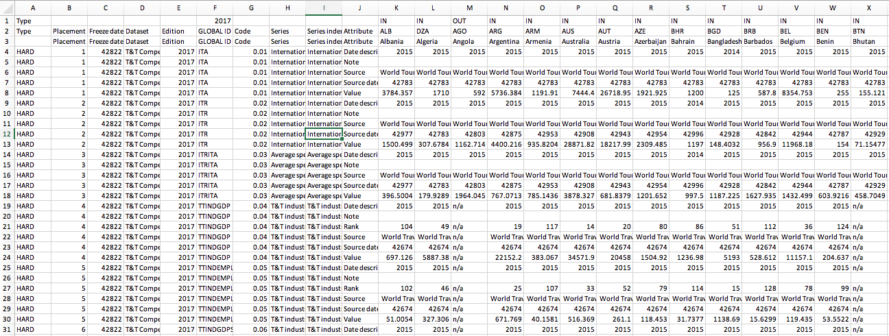
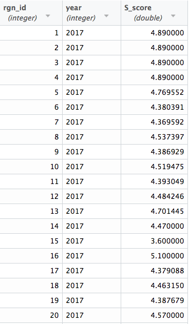
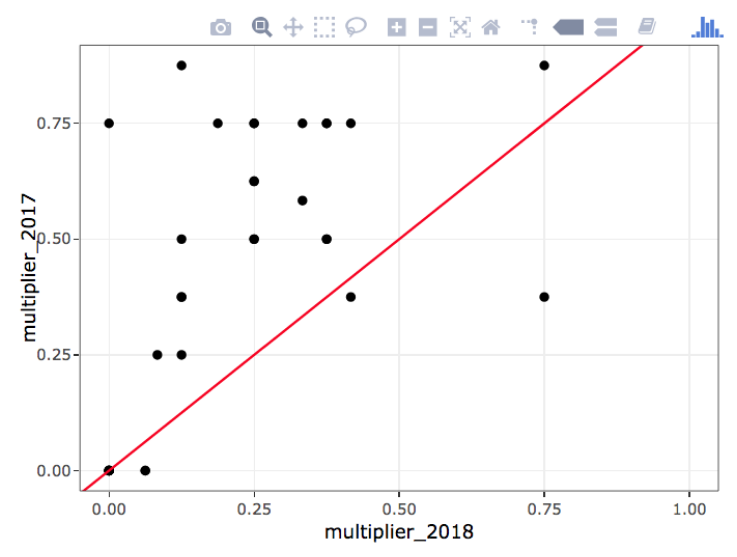

---
output:
  html_document:
    toc: true
    toc_float: true
---

<br>
<br>

***

## Geospatial processing in R
*by Iwen Su - July 30, 2018*

***

**Summary**: Geospatial processing in R is really nice, straightforward, replicable by yourself or a collaborator due to code documentation practices, and you can save iterative maps UNLESS your spatial files are massive. Then your RStudio will crash just as much or more than it would in ArcGIS. Regardless, the replicable code and iterative versioning is worth it. 

<br>

*Opening Up Shapefile Data*

There are two ways you can upload shapefiles into RStudio. You can read it in as a normal spatial polygons file (class: SpatialPolygonsDataFrame) or as a simple features file (class: sf and dataframe). While they are both spatial data, the latter acts more like a dataframe with a column for geometry information. It is a relatively new functionality and can be done through the `sf` package, which usually allows you to upload your shapefile in a LOT faster than preserving the original file type using the `sp` package. 

<br>
<center></center>  
<br>

We’re dealing with massive datasets for OHI so every second counts!

<br>

Here is an example of how to read in a spatial file as a `SpatialPolygonsDataFrame`:
```
wdpa_poly <- rgdal::readOGR(dsn = "/ohi/shps", 
                       layer = "wdpa_poly_shapefile",
                       stringsAsFactors = FALSE)
```
To determine how much time it takes to run this process, you can sandwich your code between `proc.time()` and a time-elapsed message using `cat()`. Run all of this together.
```
start <- proc.time()

wdpa_poly <- rgdal::readOGR(dsn = "/ohi/shps", 
                       layer = "wdpa_poly_shapefile",
                       stringsAsFactors = FALSE)

cat('elapsed: ', (proc.time() - start)[3])
```
```
elapsed: 402.000
```
Time elapsed is 402 seconds, or 6.7 minutes.

<br>

Alright, what if we read in the spatial file as an `sf` or `dataframe` object:
```
start <- proc.time()

wdpa_sf <- st_read(dsn = "ohi/shps", 
layer = "wdpa_poly_shapefile")

cat('elapsed: ', (proc.time() - start)[3])
```
```
elapsed:  49.000
```
Time elapsed is only 49 seconds!

<br>

The simple features format of the spatial file is processed a lot faster than the shapefile format. While in this case the difference is only about 5 to 6 minutes, the time `sf` will save you will become more important when you read in larger shapefiles. Or if you have to finish up your task to make it to happy hour. 

<br>

*Viewing Spatial Data*

The strengths of dealing with spatial data in R is the geospatial processing or subsetting and manipulation of the values itself. What’s really cool about `sf` is that you can manipulate the attribute table associated with the data using your handy `dplyr` and `tidyverse` tools. This is because the simple features spatial object is essentially just a data frame or tibble with a column for the spatial coordinates information.

Usually, viewing the actual attribute table is really laggy in R and can cause the program to crash, especially since spatial files are often really large. Or you just have to wait several minutes. For example, when trying to view the data for the spatial file using `View(wdpa_sf)`, I received a “Page Unresponsive” message: 

<br>
<center></center>  
<br>

Instead of viewing the entire data table, I prefer to explore summary snippets of the spatial data in the console, such as the column names:

```
names(wdpa_sf)
 [1] "wdpaid"     "name"       "orig_name"  "desig"     
 [5] "desig_eng"  "desig_type" "iucn_cat"   "marine"    
 [9] "no_take"    "no_tk_area" "status"     "status_yr" 
[13] "mang_auth"  "mang_plan"  "verif"      "sub_loc"   
[17] "parent_iso" "iso3"       "geometry" 
```
I can look at a summary of the different columns:
```
summary(wdpa_sf)
     wdpaid                                            name       
 Min.   :        1   Mangroove                           :   172  
 1st Qu.:   187232   Ek                                  :   143  
 Median :   392042   Local Land Trust Preserve           :    53  
 Mean   :232758618   Not Reported                        :    53  
 3rd Qu.:555551680   Kiimingin Letot (luonnonsuojelualue):    51  
 Max.   :555636685   Wetlands                            :    29  
                     (Other)                             :215268 
          no_take         no_tk_area               status      
 All           :   663   Min.   :      0.0   Designated:215769  
 None          :   328   1st Qu.:      0.0                      
 Not Applicable:201539   Median :      0.0                      
 Not Reported  : 12724   Mean   :     39.7                      
 Part          :   515   3rd Qu.:      0.0                      
                         Max.   :1555851.0                      
                                                               

```

This is a lot better than waiting for it to open in the window. 

<br>

*Subsetting & Manipulating*

If you want to create a subset of the spatial data in ArcGIS, you have to go through a tedious process in "Select By Attributes" with no option to save your processing method (e.g. STATUS_YR >= 2015). So let’s say you want to filter your dataset using different criteria, your previous specification will be removed. The only thing you can save is the output data, but not the code you used to create it. This makes replication and data checking difficult.

<br>
<center></center>  
<br>

Subsetting the spatial data in RStudio can make it a bit more manageable to plot. Here, I’m just going to focus on MPAs designated in year 2015 onwards, the area of any no take designation within the reserve, and the year the MPA was first designated.
```
wdpa <- wdpa_sf %>% 
  filter(status_yr >= 2015) %>% 
  select(name,no_tk_area,status_yr)
```
As an `sf` object, I can treat the spatial data just like a data frame and use `dplyr` functions such as `filter` and `select` to "Select By Attributes". This preserves the original data and easily creates a new data frame with the truncated version. So now I have original dataset `wdpa_sf` and intermediate dataset called `wdpa`.

<br>

*Exploring & Plotting*

You can plot spatial files in RStudio as well once you've read it in and filtered it as desired, but it’s usually a simplistic glance.

```
plot(wdpa_sf[1])
```

<br>
<center></center>  
<br>

What are all the values? So the [1] specifies that you are taking the values in the first column, which is meaningless as it is just a WDPA id number. Let’s say I don’t want any special values. I can use `st_geometry` to just plot the shapes without values:

```
plot(st_geometry(wdpa_sf))
```

<br>
<center></center>  
<br>

You can also add annotations to take a better look at the values, but this would require an understanding of the columns or attributes first. It looks like I can categorize the values by either the **No Take Area**, **Status Year** (the year it was designated), or **IUCN category** column.

I want to plot values of no take areas for each protected area designation. I can call the name of that column, `no_tk_area` to map the values.

```
wdpa <- wdpa_sf %>% 
  filter(status_yr >= 2015) %>% 
  select(name,no_tk_area,status_yr)

library(maps)
plot(wdpa["no_tk_area"], axes = TRUE, main="Global No Take Area in MPA Zones")
```

<br>
<center></center>  
<br>

The `axes` annotation added latitude and longitude coordinate axes and `main` was used to specify a title. However, I'd like to add continents onto this map as a background layer. This can be accomplished with the `maps` package.

```
library(maps)
plot(wdpa["no_tk_area"], axes = TRUE, main="Global No Take Area in MPA Zones");maps::map('world',add=T, fill=T, col='gray')
```
<br>
<center></center>  
<br>

*Geospatial Processing*

The last topic I'll only touch upon briefly. Many of the geospatial processing tools you conduct in ArcGIS, such as transforming coordinate systems or finding the intersection between two shapefiles have equivalents in the `sf` package.

Here I want to transform the coordinates of my shapefile **regions** into the same coordinate system as the shapefile **wdpa_sf**. First I read the shapefiles in using the `sf` method,
```
regions <- sf::st_read(dsn = "some/file/path/to/folder", layer = "name-of-shapefile-without-extension")

wdpa_sf <- sf::st_read(dsn = file.path(dir_M, 'git-annex/globalprep/_raw_data/wdpa_mpa/d2018/WDPA_June2018-shapefile'), layer = 'WDPA_June2018-shapefile-polygons')
```
then with a single line of code, I can transform the coordinates system in **regions** to match that of **wdpa_sf**.
```
regions_transformed <- st_transform(regions, st_crs(wdpa_sf))
```
Finding the intersection is as simple as running a single function: `st_intersection` and specifying the polygons of interest.
```
find_intersection <- st_intersection(wdpa_18, regions_t)
```

Not only are these spatial analyses and processing tools available in R, but, once again, you have the capability to document and share how you created intermediate shapefiles, step by step. See [`sf` tutorial](https://r-spatial.github.io/sf/articles/sf1.html) for a list of other common geospatial processing functions.

**Conclusion**: Even though ArcMap crashes a lot and can also be quite laggy, viewing and exploring spatial data visually is often best in ArcMap OR QGIS which is free, instead of R, especially if your geographic range is large (like the GLOBAL EXTENT). However, if you don’t have a lot of money to throw or work for a spatial company, R can show you the basics and is particularly smooth when documenting and running geospatial processing. If you were only working on a smaller region like the United States or California, then it may be easier to make a quick map to email someone but not for publication necessarily, since you’re missing out on ArcMap’s nice alignment guides, titles, subtitles, adding basemaps as easily.


***

## Behind the scenes: Data_prep
*by Camila Vargas - July 16, 2018*

***
On March 6 2018 we read [Introduction to Open Data Science. Chapter 6: Data Wrangling - Dplyr](http://ohi-science.org/data-science-training/dplyr.html). This chapter starts with the quote:

<br>

> “Data scientists, according to interviews and expert estimates, spend from 50 percent to 80 percent of their time mired in the mundane labor of collecting and preparing data, before it can be explored for useful information. -[ NYTimes (2014)](https://www.nytimes.com/2014/08/18/technology/for-big-data-scientists-hurdle-to-insights-is-janitor-work.html)"

<br>

This was the beginning of our training in data wrangling, four months ago. Throughout these months, I’ve realized that though this quote is quite accurate -- we do spend most of our time collecting and preparing data -- I disagree in describing this labor as mundane.

It is not easy, that’s for sure. And many times it can be frustrating and feel hopeless. But one thing is for certain: by going over a dataprep script, I have learned much more about coding and R functions than in any class I’ve taken.

One of the most important parts of calculating the Ocean Health Index is preparing the data. First, we see if there are any updates on the data from each of the data sources. Then, if the data has been updated, we download the raw data from the pertinent source, wrangle it and organize into the necessary form to calculate scores. 

It is something close to magic. By running a data_prep script you go from something extremely overwhelming like this:

<br>
<center>



</center>

<br>

 To something as tidy as this:

<br>
<center>



</center>

<br>

But it is not quite magic. This whole procedure is far from being a single spell with a magic wand. Nothing is less straightforward than the process of preparing data. 

Here, I’ll share some insights from my experience so far:

* Every time I start a new script I’m optimistic. I start with the idea that this will be fairly uncomplicated. The data is not too muddled and there is already a script that takes care of the process.

* Here we go. We start by searching if there are any updates to the data. Data has been updated. That is good. More data means that our analysis will be more robust and up-to-date. But, obstacle \#1: the data source changed the way they reported the data. 

* This is not necessarily bad. Looking at the big picture, changes in the way data is reported can mean improvement in the data, which overall means improvement in our analysis. In many cases though, it also means that we have to revise our methods. But, methods cannot change too much because they should be as consistent as possible so that the index can be compared through time. 

* And then, not only the method, but little things like the format of the new data, how each region is reported, and does that match with the OHI regions, and so on. All of this must be adjusted in a nuanced way.

* Finally you get everything to work. Yihaa!! Definitely a moment of pride. The final step is to check if the outcome you are getting with this year’s data is similar enough to the outcome of last year’s data. And then you get something like this… 

<br>
<center>



</center>

<br>

* Not quite a match. And here we go again.. Check everything you have done. Revise methods, revise code, check data in every step of the wrangling process. The goal is to figure out why is the data so different from last year assessment.

<br>

That is in part what we do. We spend 50%, probably closer to 80%, of our time collecting and preparing data. It is challenging, but the kind of challenge that, at least for me, makes me want to spend all the necessary time to find the best solution. Maybe you spend way more time than what you anticipated. But at the end, when you reach the final outcome, there is a great satisfaction. You finally get to input the data into ohi-global which sources functions from ohi-core, an R package that calculates status, trend, pressure, resilience, and in some cases, scores. Yes finally, scores!

This whole process is compared to the job of an editor, or the backstage of a show: so much hard work behind the scenes is never seen by the final audience. But without all this work the play would not play. Behind the scenes is key for putting together a successful show!  
Some of us chose this role. I wanted to share a little bit of how the OHI day-to-day looks for me: long, hard hours and days of work, constantly checking if what you are doing make sense, revising methods and outcomes, comparing outcomes to what has been obtained years before. A great learning experience and overall very rewarding (even addictive). 


<br>


***

## Grappling with Graphics
*by Ellie Campbell - April 30, 2018*

***

The plotting capabilities in base plot in R are good, but for more flexibility and control, [ggplot](http://ggplot2.tidyverse.org/) is the gold standard. In ggplot, the first line creates a plot object and points to whatever data you will be plotting. Then, one can dictate the form of the plot using any number of “geoms,” designing individual components separately and adding them to the plot, along with formatting elements like labels, title, and themes. 

My first introduction to ggplot, and to R as a whole, was through the lab component of a statistics course I took my first year at the Bren School. That first time around, ggplot was introduced in lecture with a few associated in-class exercises and then over the course of the semester I spent hours tinkering with and refining presentation -- palettes, graph types, fonts and features -- for various assignments, a process that involved lots of google searches and scrounging through [stack overflow](https://stackoverflow.com/questions/tagged/ggplot2?sort=frequent&pageSize=50) for fragments of code to get things like outlines, or legends, or offsets in bar graphs just precisely right.

A few weeks ago, we went over the use of ggplot as part of our training in preparation for calculating the 2018 OHI. We began with a [structured tutorial](http://ohi-science.org/data-science-training/ggplot2.html) also, and dove deeper into the meaning and syntax of the arguments, walking step-by-step through some of the nitty-gritty details and more advanced capabilities. One thing in particular that became more clear to me, was the functionality of aes() or the “aesthetics,” which was something I’d found particularly confusing in my first encounters with ggplot. For example, it was not completely clear to me why you would put some arguments within aes() and some outside aes(), or define x and y in aes() in the first line versus individual geoms; e.g. these give the same plot:

```{r, comment=FALSE, include=FALSE, cache=FALSE}
library(reshape2) # will use the tips dataset from reshape2
library(ggplot2)
library(gridExtra)
```

```{r defining x & y in aes at beginning or in each component, fig.keep = "none"}
ggplot(data = tips, aes(x = total_bill, y = tip/total_bill, color = day)) + 
  geom_point(size = 0.25)

ggplot(data = tips, aes(color = day)) +
  geom_point(aes(x = total_bill, y = tip/total_bill), size = 0.25)

ggplot(data = tips) +
  geom_point(aes(x = total_bill, y = tip/total_bill, color = day), size = 0.25)
```

<br>

```{r plot, echo=FALSE, fig.height = 2.4, fig.width = 8}
p1 <- ggplot(data = tips, aes(x = total_bill, y = tip/total_bill, color = day)) + 
  geom_point(size = 0.25) +
  guides(color = FALSE) +
  theme_bw() + 
  labs(x = " ", y = "Tip / Total Bill") 

p2 <- ggplot(data = tips, aes(color = day)) +
  geom_point(aes(x = total_bill, y = tip/total_bill), size = 0.25) +
  guides(color = FALSE) +
  theme_bw() + 
  labs(x = "Total Bill", y = " ") 

p3 <- ggplot(data = tips) +
  geom_point(aes(x = total_bill, y = tip/total_bill, color = day), size = 0.25) +
  guides(color = FALSE) +
  theme_bw() + 
  labs(x = " ", y = " ") 

grid.arrange(p1, p2, p3, nrow = 1) # plot side-by-side in one row
```

<br>

Other takeaways for me were (1) modularity of ggplot means it is good for more complicated graphics, but perhaps unnecessarily verbose for simple plots (2) [facetting](http://www.cookbook-r.com/Graphs/Facets_(ggplot2)/) is a very helpful feature for looking at multifaceted data (3) there are many [theme options](https://yutannihilation.github.io/allYourFigureAreBelongToUs/ggthemes/) for making pretty plots, some of which can be found in the [ggthemes](https://cran.r-project.org/web/packages/ggthemes/vignettes/ggthemes.html) package, and (4) ggplot is especially powerful for data visualization when combined with other packages in [tidyverse](https://www.tidyverse.org/)! For example, using some data from the gapminder dataset:

```{r load dplyr, comment=FALSE, include=FALSE, cache=FALSE}
library(dplyr)
library(gapminder) # will use gapminder dataset
```

```{r code example of using tidyr/dplyr to rearrange, echo = TRUE, results = "hide", fig.keep = "none"}
gap <- gapminder %>% 
  filter(continent == "Europe") %>% 
  mutate(cummean_gdpPercap = cummean(gdpPercap)) %>% 
  group_by(country) %>% 
  filter(max(cummean_gdpPercap)-min(cummean_gdpPercap) > 2000) %>% 
  ungroup()

ggplot(data = gap) +
  geom_line(aes(x = year, y = cummean_gdpPercap), color = "lightsteelblue") + 
  geom_line(aes(x = year, y = gdpPercap), color = "coral") +
  facet_wrap(~ country) +
  theme_bw() + 
  labs(x = "Year", y = "Cumulative Mean per Cap. GDP \n") 

```

<br>

```{r plot with facetting, echo = FALSE, fig.height = 2.9, fig.width = 7}
ggplot(data = gap) +
  geom_line(aes(x = year, y = cummean_gdpPercap), color = "lightsteelblue") + 
  geom_line(aes(x = year, y = gdpPercap), color = "coral") +
  facet_wrap(~ country) +
  theme_bw() + 
  labs(x = " ", y = "Cumulative Mean per Cap. GDP") 

```

The details of ggplot stuck with me somewhat better this time around, and it is hard to say how much of that was because of previous hours spent tinkering with ggplot, and how much was because we walked through the details step-by-step and as a group.  I wonder, when developing proficiency with some computer language or software, what is the relative return from hours spent on collaborative learning, structured tutorials, or individual tinkering? What about an optimal combination of these? 

There’s certainly an huge advantage to learning with others -- you can bounce ideas off each other, and ask for help. And it is more fun! Having a mentor is likewise invaluable. Despite the vast online help available and the magic that is Google, sometimes asking another human is a shorter, easier path to answers we are seeking. 

<br>
<br>

***

## GitHubbing through Life
*by Iwen Su - April 6, 2018*

***

My first experience with GitHub was fairly painless, except that I hadn’t differentiated it from just another server where you could store your files and folders. “Pull, push, and commit” was written on the whiteboard so we could remember the order of operations to update files. For the most part, I didn’t run into any errors. However, many of the capabilities that GitHub wielded were unknown to me. I didn’t know that you could essentially rearrange folders and files on your local computer and update the version online with the new configuration. 

It wasn’t until I watched Julie Lowndes’s video on [being a marine data scientist](http://seawater.stanford.edu/Lowndes.mp4), which did a section on using GitHub, that I got a glimpse into why you would use it, the array of things you can do with it, and what all these new terms such as “branches” and “committing” meant. In the talk, Julie quotes a [2016 Nature article](https://www.nature.com/news/democratic-databases-science-on-github-1.20719) that describes GitHub functionality:

<br>

> “For scientist coders, [Git] works like a laboratory notebook for scientific computing ...it keeps a lasting record of events” 

<br>

Wait, what is “Git”? Is it just shorthand for “GitHub”? Actually, Git is the version control system  that is responsible for keeping the lasting record of events. GitHub is a space, like a library, that can hold numerous laboratory notebooks, or data science projects. Andrew McWilliams does a good job at explaining the technical and functional differences between the two in a [blog post](https://jahya.net/blog/git-vs-github/).

For my master’s group project, we decided to use GitHub as our versioning library for our data analysis. The nature of the project required more than one person to work on the same document or code simultaneously. Immediately we ran into issues collaborating on the same document. These are also known as “merge conflicts” in the Git world. None of us had gotten proper training or guidance about what to expect when a merge conflict arises. Sometimes we wouldn’t notice until several days later that, to our surprise, the excel file we had been working in now had two copies of the data table, one on top of the other, accompanied with strange symbols and headers, such as:

<br>

```
<<<<<<< HEAD
```
or 
```
=======
```

<br>

Through the OHI training, I learned that this was a separator partitioning my version of the data table from my peers’ updates to the data table. We experienced several headaches from rewriting each other’s work before we realized that Git was trying to tell us something in error messages like: 

<br>

```
CONFLICT : Merge conflict in urchindata.csv 
Automatic merge failed; fix conflicts and then commit the result
```

<br>

Often times the error messages are intimidating, because there is coding lingo thrown into it. However, the messages usually give us a good hint as to what is causing the error. Nevertheless, there are many barriers to entry to learning GitHub and learning to want to use GitHub. One of those is the jargony vocabulary of key terms only used in the Git and GitHub world: commit, branches, merge conflicts, pull, push, master branch, repository, and projects. Check out our cheatsheet on Git terminology [here](z2_gitTerminology.html).

<br>
<br>

***

## First Impressions
*by Camila Vargas - February 23, 2018*

***

New year, new challenges. We joined the OHI team in late January this year. I was excited to find out what our day-to-day "office" would look like. Before starting this job, I had a basic understanding of the OHI project, but to be honest, I had pretty limited experience with R (not a whole lot) and that was it. I'm a curious learner, but I would definitely not define myself as a computer programming person. Yet, here I was. 

Our first "homework" was to read through the [OHI 2017 Methods](https://rawgit.com/OHI-Science/ohi-global/draft/global_supplement/Supplement.html). While, we didn't need to read the whole thing in detail, it was important for us to get a glimpse of how the OHI is actually calculated.  

At a first glance, it was OK. I thought it was interesting to dig into the actual math within this index. But of course you don't get the whole picture just by reading some of the method document. One of the biggest challenges (my fellow fellows agreed with me on this) was to relate the entire workflow outlined in Figure 1.1 with what is actually going on in the math -- and with this I mean the formulas. Challenges inspire! We started creating an expanded version of this figure to help us connect the dots faster (not yet finalized but will soon be displayed in the OHI theory tab!).

While we were introduced to the theory behind OHI, we also walked through how everything is organized, where the actual information is, and how to get to it. All I can say about this is that it's all about links and more links. Too many links. I'm not sure if my brain is stuck in the mindset of organizing things into respective folders or if it's just because everything is new, but it was overwhelming to learn that there are html links for everything. For example, from the OHI 2017 Methods, there are links to GitHub and links to other websites that explain certain topics in more detail. 

> My initial reaction was: WHAT IS WHAT AND WHERE IS EVERYTHING?

By the end of the day, I realized it was just panic from exposure to something new. Just breath. I'm sure at some point we are going to figure out how the information is organized (because I'm pretty sure it is already well organized). Nevertheless, the OHI fellows are working on a visual explanation of this link chaos.

And links were not the only chaotic thing. We were also introduced to Github and R Markdown. Amazing tools! But you have to break the ice before you can feel comfortable and actually know what you are doing. It seemed overwhelming at the beginning, but after only four sessions of working with all this new information and I already feel more comfortable. 

I am enjoying the challenge. Learning a whole lot. And looking forward to communicating to you all about our progress and experience!

