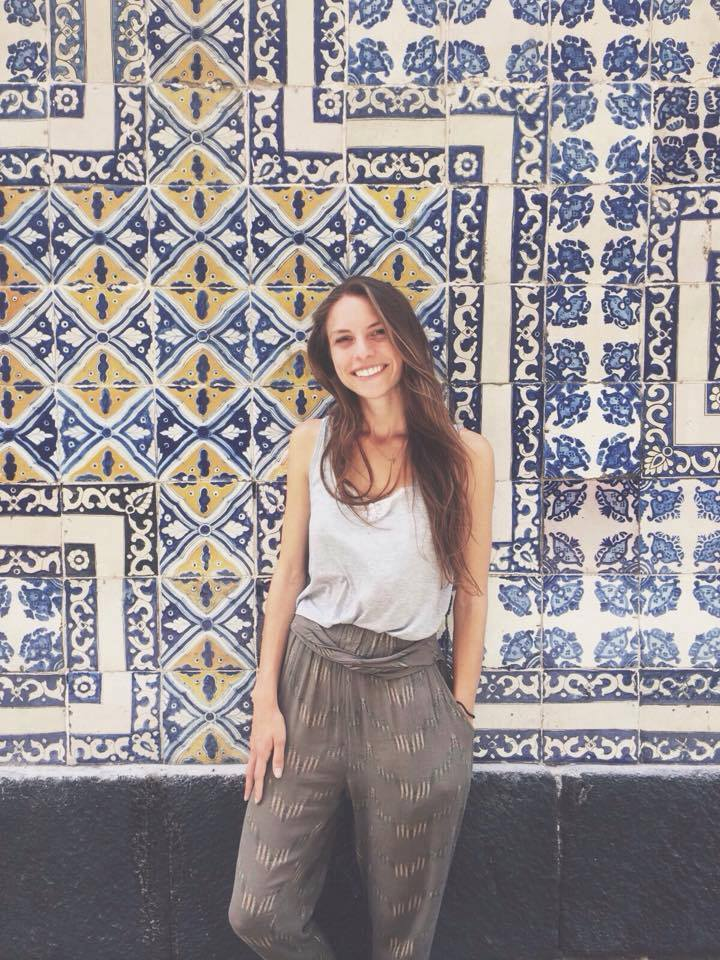
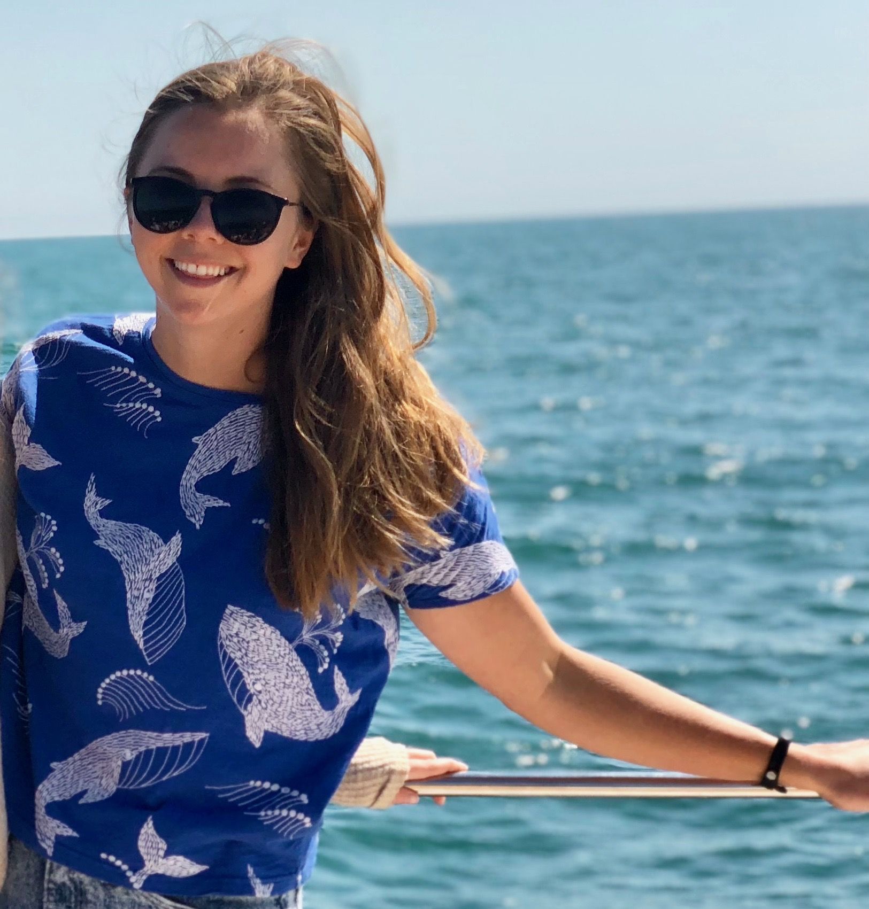
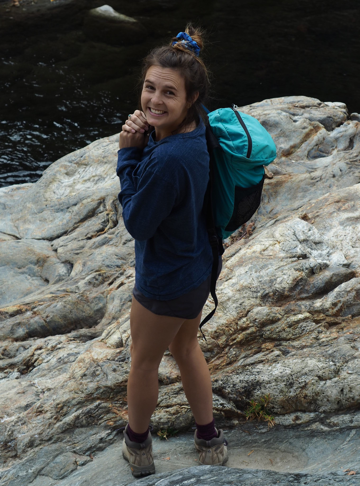

---
title: "OHI Fellows"
output: html_document
---  

 
 

***
## **2020 Fellows**

 

### Madeline Berger

A San Francisco Bay Area native, Madeline learned to scuba dive in the Monterrey Bay at age 15 sparking a passion for coastal and ocean ecosystems. Madeline holds a B.A. in Economics from the University of California Los Angeles, where she also minored in Environmental Systems. After working in the private sector and as a Research Intern at the Natural Capital Project at Stanford, she is now a 2nd year Master’s at the Bren School, specializing in Conservation Planning and focusing on Environmental Data Science.

At Bren, she has had the chance to work on a variety of projects at the intersection of conserving ecosystems and sustainable livelihoods, focusing primarily on tropical regions. As an intern at Conservation International, she helped collect and visualize data on indigenous land rights in the Amazon, and more recently has been helping to evaluate a pilot project turning artisanal fishery waste into fertilizer in the Galapagos. As an OHI fellow, she is excited to leverage her interdisciplinary background and strong data analysis skills to assess ocean health on Tetiaroa Island.

Maddie was a competitive swimmer for many years and still takes any chance possible to get in the pool or ocean in her free time. She also loves to hike, explore the beautiful Santa Barbara area, and experiment in her kitchen. 

 

***

### Laura Ingulsrud

Laura grew up in Sacramento, CA and Tokyo, Japan, but has lived in Santa Barbara for the past 10 years. She moved here to get an Environmental Studies degree at UCSB and quickly fell in love with the central coast. After graduating, Laura worked as a sailing instructor, guide on Mt. Fuji, and environmental consultant before going back to grad school.  

She is now a 2nd year master’s student at the Bren School of Environmental Science & Management specializing in Coastal Marine Resources Management and Conservation Planning with a focus in Environmental Data Science. Her graduate project is focused on creating a marine spatial plan for Dominica to reduce ship strike threats to the resident sperm whale community. As a global OHI fellow, Laura is excited to combine data science with marine science and policy to help inform sustainable ocean management. Laura spends her free time playing in the ocean, obsessing over whales, and enjoying good food with friends.

 
 

 

***

### Sara Orofino

Sara grew up in Placerville, California a town in the Northern Sierras. She graduated in 2014 from Oregon State University with a B.S. in Zoology. After college, she spent four years bouncing around from California to Southeast Asia and the Bahamas leading scuba diving tours, teaching marine science courses, and communicating scientific research to broad public audiences.   

Now a second-year masters student at the Bren School of Environmental Science & Management, she is specializing in Coastal Marine Resource Management and building her data science capabilities through the Environmental Data Science focus. Her two graduate research areas are focused on evaluating strategies for better managing data-poor fisheries in the face of climate change and studying factors that make communities more resilient to natural disasters. As an OHI fellow and soon-to-be graduate, she hopes to use data science to inform management solutions protecting threatened coastal resources and the communities that rely on them. In her free time, Sara loves to snorkel, scuba dive, read good books, and explore with friends.    

 
 
 
 
 

 

***

 

## **2019 Fellows**

 

### Gage Clawson

Gage grew up in Manteo, North Carolina, a town located on a small island in the Outer Banks. He graduated from the University of North Carolina at Chapel Hill in 2018 with a B.S. in Statistics and Analytics and a B.A. in Music. Throughout college Gage performed in many of UNC’s ensembles, including the Jazz, Trumpet, and Wind Ensembles. Although he has a passion for music, his passion for statistics and the environment is stronger. Seeing firsthand the effects of environmental degradation on his hometown inspired his interest in environmental science.

He is now a first-year student at the Bren School, pursuing a specialization in Coastal Marine Resources Management with a focus in Environmental Data Science. He hopes to pursue a career in which he can apply his analytical skills to solve environmental issues and preserve the livelihoods of those living in coastal communities.  In his free time, Gage is an avid trumpet player, hiker, and general outdoorsy person. 

 

***

### Molly Williams

Molly is originally from Seattle, WA and grew up in and around the Pacific Ocean. She received her undergraduate degree in Environmental Studies on the other coast at Mount Holyoke College. During this time, she spent a semester abroad studying in the Turks and Caicos Islands where she was captivated by the marine life as well as the challenge of managing human-environment relationships.

After spending a few years teaching math in Hawaii and then wrangling microbes at an algae biofuel startup in Florida, Molly is now a second-year master’s student at the UCSB Bren School of Environmental Science & Management. She came full circle back to the marine world, and is specializing in coastal and marine resources management and environmental data science. Her graduate work is focused on developing data management strategies for a local citizen science project run by the Channel Islands National Marine Sanctuary that monitors whale presence in the Santa Barbara Channel. As an OHI fellow and soon-to-be Bren graduate, she hopes to leverage her data science skills towards the preservation of both cultural and ecological systems. 

 

***

 

## **2018 Fellows**

 

### Camila Vargas

Camila is originally from Santiago, Chile and holds a degree in Biology from Pontificia Universidad Católica de Chile (PUC), with a major in ecology and specialization in natural resources management. Her working experiences has mostly been related to academic research for the Marine Conservation Center – PUC, exploring social-ecological systems dynamics in small-scale fisheries in Chile.

Camila’s primary research focused on gender roles in small-scale fisheries along the coast of central Chile. She has also collaborated on a range of projects, from research to review biodiversity offset’s in the scientific literature, to an initiative with a PNUD project aimed to develop a credit system for marine biodiversity offsets for the central coast of Chile. She has also been involved in several field works assessing fishers’ perceptions on adaptive capacity and evaluating fishers’ collaborative behavior through game theory experiments.  

She recently graduated from her master degree at the Bren School of Environmental Science and Management, as a Latina America Fisheries Fellowship, with specialization is in Coastal Marine Resource Management. For her masters group thesis, Camila together with 4 colleagues worked on developing a user-friendly hub that integrates scientific knowledge, case studies and analitical tools for creating effective no-take marine reserves.

Her focus on marine resources is motivated by her passion for ocean and marine life as well as her desire to develop solutions, using the best available science, for threatened coastal resources which are the main livelihood for many coastal communities.

 

***

### Iwen Su

Iwen grew up in San Diego and Taiwan, and received her B.A. in Biology, Marine Emphasis from Occidental College. After graduating, she set off to Madagascar for three months to conduct underwater surveys on coral reefs. She has also volunteered on various projects throughout San Diego, including coral identification at the Scripps Institution of Oceanography, event planning for WildCoast, and scientific diving with San Diego State graduate students. During this time, Iwen primarily worked along the coast collecting recreational fisheries data for the CA Department of Fish and Wildlife and on the water for a white seabass enhancement project at the Hubbs-Seaworld Research Institute. 

She is now pursuing a specialization in Coastal and Marine Resources Management at the Bren School. Over the last year and half, she’s worked on various projects at NCEAS including the Arctic Data Center, the SeaSketch-TNC groundfish spatial plan, and now the Ocean Health Index. Her career interests include marine spatial planning for fisheries and aquaculture and seafood sustainability. Outside of school, Iwen enjoys diving artificial reefs, and drawing pictures of sea-creatures to hang on her walls.

 

***

### Ellie Campbell

Ellie graduated from the Bren School of Environmental Science & Management, where she pursued a Masters of Environmental Science and Management with a specialization in Energy and Climate. Originally from Anchorage, Alaska, Ellie graduated from Colorado College in 2016 with a B.A. in Mathematics. For her masters project, she collaborated with four peers to synthesize an ecological monitoring framework for the Tejon Ranch Conservancy, incorporating drones and other remote sensing technologies. She previously worked with Conservation Science Partners on GLUED (Global Land Use/Cover Emergent Database), a platform to collect and share data on land use and land cover. She gained additional technical training in remote sensing methodology through an interdisciplinary research experience for undergraduates at the University of Northern Iowa. In her free time, she enjoys spending time outdoors skiing, running, and playing ultimate frisbee.

 

 

***

 
 
