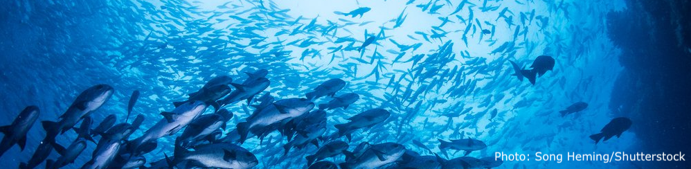

---

## **Learning about Open Data Science & the Ocean Health Index**
<!--html_preserve-->
<div id="homeContent">
    
</div>
<!--/html_preserve-->

<br>
<br>

### What is Open Data Science?
Open data science is a movement towards sharing data and standardizing methods of analysis to allow for reproducibility.

<br>
<br>

### About Us
This site documents our experience in learning about the Ocean Health Index (OHI) and the open data science practices used in calculating it. Our achievements, issues, problems, thoughts and comments throughout the process are chronicled here.

<br>
<br>

### OHI Fellows Timeline
The timeline measures our progress and records milemarkers on our OHI adventure. We began learning the necesary tools on January 2018, and will finish calculating the global OHI scores for this calender year sometime late September.

<center>
```{r echo=FALSE}

library(timevis)

data <- data.frame(
  id      = 1:9,
  content = c("First day!", "Built our first website",
              "Completed ggplot training", "First blog post",
              "Completed tidyverse training", "Learned how to gapfill",
              "Data preparation training", "OHI file organization",
              "Complete MAR Data Prep"),
  start   = c("2018-01-26", "2018-02-16",
              "2018-02-23", "2018-02-23",
              "2018-03-06", "2018-03-23",
              "2018-03-23", "2018-04-06",
              "2018-04-18"),
  end     = c(NA, NA, 
              NA, NA, 
              NA, NA,
              "2018-04-13", NA,
              "2018-05-03")
)

timevis(data)

```
</center>

<br>

