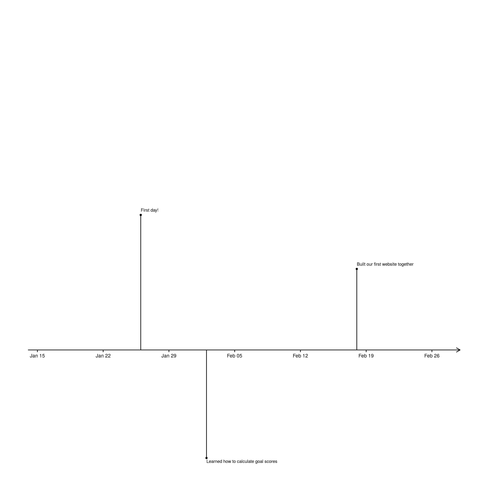
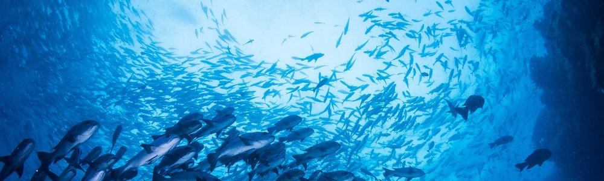

 
 

## Learning about Open Data Science & the Ocean Health Index

 
 

This site documents our experience in learning about the Ocean Health Index (OHI) and the open data science practices used in calculating it. The timeline measures our progress and records milemarkers on our OHI adventure. We began learning the necesary tools on January 2018, and will finish calculating the global OHI scores for this calender year sometime late September. Our achievements, issues, problems, thoughts and comments throughout the process are chronicled here.

  

 
 

  
