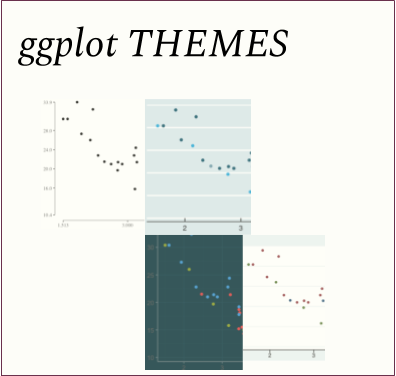

```{r setup, include=FALSE}
knitr::opts_chunk$set(echo = TRUE)
```

## This is our R and RMarkdown blog page

<br>


[{width=250px}](z1_whyRmd.html) [{width=250px}](z1_whyRstudio.html) [{width=250px}](z1_TexEquations.html)  
[{width=250px}](z1_ggplotThemes.html) 
