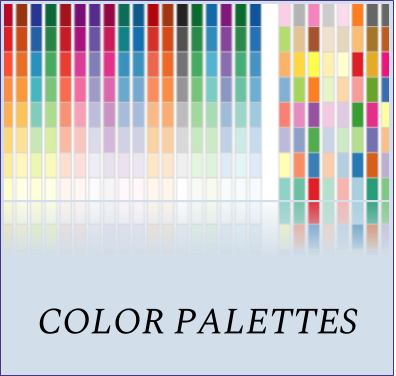

```{r setup, include=FALSE}
knitr::opts_chunk$set(echo = TRUE)
```

<br>
<br>

[{width=250px}](z1_whyRmd.html) [{width=250px}](z1_colorPalettes.html) [{width=250px}](z1_stringRtips.html)

**Helpful Resources**

[R Cheatsheets](https://www.rstudio.com/resources/cheatsheets/)

[R for Data Science (R4DS)](http://r4ds.had.co.nz/)

[OHI Data Science Training](http://ohi-science.org/data-science-training/index.html)