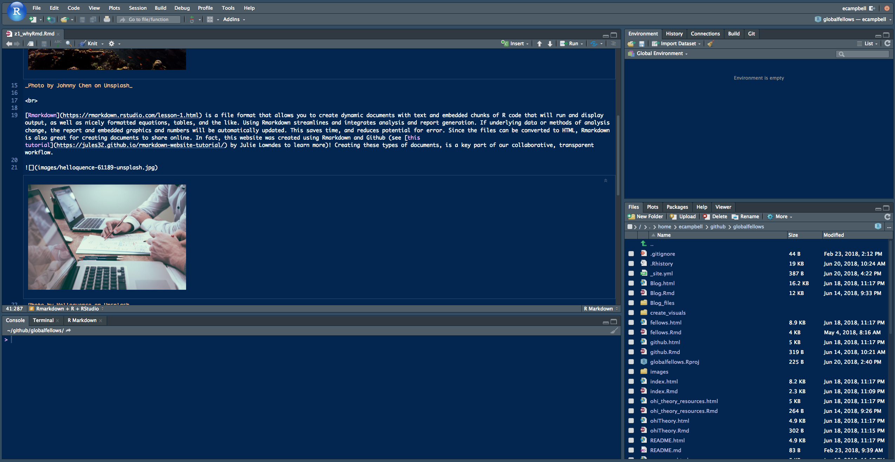
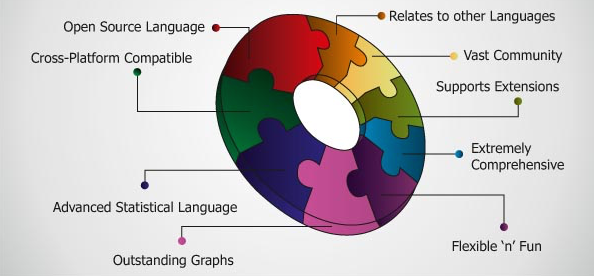
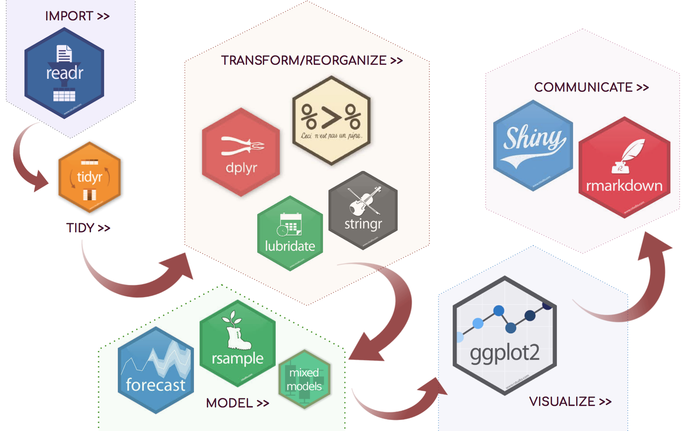

```{r setup, include=FALSE}
knitr::opts_chunk$set(echo = TRUE, fig.align = "center", fig.width = 20)
```

<br>

## Rmarkdown + R + RStudio
***



<br>

[Rmarkdown](https://rmarkdown.rstudio.com/lesson-1.html) is a file format that allows you to create dynamic documents with text and embedded chunks of R code that will run and display output, as well as nicely formatted equations, tables, and the like. Using Rmarkdown streamlines and integrates analysis and report generation. If underlying data or methods of analysis change, the report and embedded graphics and numbers will be automatically updated. This saves time, and reduces potential for error. Since the files can be converted to HTML, Rmarkdown is also great for creating documents to share online. In fact, this website was created using Rmarkdown and Github (see [this tutorial](https://jules32.github.io/rmarkdown-website-tutorial/) by Julie Lowndes to learn more)! Creating these types of documents, is a key part of our collaborative, transparent workflow.


_Photo by Helloquence on Unsplash_

<br>

With a few exceptions, the Ocean Health Index models and data-wrangling routines are all written in R, an open source statistical programming language, and the lingua franca of data science. There were many [reasons for choosing R](https://www.nature.com/articles/s41559-017-0160) for the project, which are elaborated on in this 2017 article. 

{width=600px} [{width=298px}](http://r4ds.had.co.nz/)

In addition to its prevalence and popularity, R has a thriving, energetic community which means there are many online resources, and it is rapidly evolving and improving. It is also capable of producing stunning [visualizations](http://gallery.htmlwidgets.org/). Many different R packages exist for different types of calculations and analysis; the figure below illustrates a general workflow with some associated packages commonly used for each stage...

<br>



<br>
<br>

We use the integrated development environment (IDE) [RStudio](https://www.rstudio.com/products/rstudio/), which makes programming, testing, troubleshooting, and visualizing simpler/more convenient. Whether writing functions, scripts, markdown documents, or creating shiny apps or packages, RStudio helps one manage projects that keep objects organized and environments tidy, and allows one to fluidly alternate between writing, testing, and troubleshooting. For information on how to get started with R, Rmarkdown, or RStudio, see our "[Helpful Resources](resources.html)" page.

<br>


_Photo by Johnny Chen on Unsplash_

