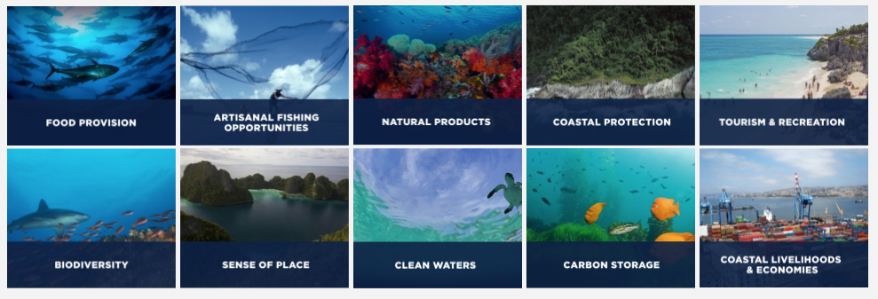

```{r setup, include=FALSE}
knitr::opts_chunk$set(echo = TRUE, fig.align = "center", fig.width = 20)
```

<br>

## How to Calculate a Goal Score
***


***

Each of the [ten goals](https://www.nature.com/articles/nature11397) have their own unique methodology. [Methodologies](https://rawgit.com/OHI-Science/ohi-global/draft/global_supplement/Supplement.html#5_goal_models_and_data) are built around the types of available data, appropriate for the analysis -- consistently quantified across the spatial scale of the assessment and quality-controlled -- and based on the best scientific understanding of the subject per expert input and peer review. Each goal score calculation takes a few different [data layers](http://ohi-science.org/ohi-global/layers_table.html) that inform present status and likely near-term future status, which is calculated from trend, pressure, and resilience information.

***

### Artisanal Fishing Opportunity

<br>

\begin{aligned}
& x_{ao} \text{   is the status of the artisinal fishing goal}\\
\\
& x_{ao} = (1 - D_u) * S_{ao}\\
& D_u = (1 - PPPpcGDP) * (1 - O_{ao})\\
\\
& D_u \text{  is the unmet demand}\\
& S_{ao} \text{   sustainability weighting; 1 if no data or perfectly sustainable}\\
& O_{ao} \text{   is the access to artisinal-scal fishing, defined by Mora et al. (2009)}\\
& PPPpcGDP \text{   is ln-transformed rescaled purchasing power parity adjusted per capita GDP}
\end{aligned}
<br>

---

### Biodiversity: Species Subgoal

<br>
\begin{aligned}
& x_{spp} \text{   is the status of the species biodiversity sub-goal}\\
\\
& x_{spp} = max \left(\frac{\bar{R}_{spp} - 0.25}{0.75}, 0 \right)\\
\\
& \bar{R}_{spp} = \left(\sum^M_{c=1} \left( \sum^{N_c}_{i=1} w_i \right) \times A_c \right) \left(\sum^M_{c=1} A_c \times N_c \right)^{-1}\\
\\
& \bar{R}_{spp} \text{  region's area-weighted mean of species risk, with floor at 25% representing catastrophic loss of biodiversity}\\
\\
& \sum^M_{c=1} A_c \times N_c \text{  is the species count-weighted area across all cells in the region}\\
\\
& N \text{  is the number of species ($N_c$ is number species in cell $c$)}\\
& M \text{  is number of gridded cells the region's area contains}\\
& c \text{  a 0.5 degree grid cell within a region}\\
& w_i \text{  the risk status for each species $i$, assigned based on IUCN threat category}\\
& A_c \text{  area of cell $c$}
\end{aligned}
<br>

---

### Biodiversity: Habitats Subgoal

<br>
\begin{aligned}
& x_{hab} \text{   is the status of the habitat biodiversity sub-goal}\\
\\
& x_{hab} = \left(\frac{1}{N}\right) \sum ^N_{k=1} C_k\\
\\
& C_k = \frac{C_c}{C_r}\\
\\
& C_c \text{  is the current condition specific to each $k$ habitat present in the region}\\
& C_r \text{  is the reference condition specific to each $k$ habitat present in the region}\\
& N \text{  is the number of habitates in the region}
\end{aligned}
<br>

---

### Carbon Storage

<br>
\begin{aligned}
& x_{cs} \text{   is the status of the carbon storage goal}\\
\\
& x_{cs} = \left(\sum^N_{k=1} (h_k \times w_k \times A_k) \right) \left(\sum^N_{k=w} (w_k \times A_k) \right)^{-1} \\
& h = \frac{C_c}{C_r}\\
\\
& h \text{   is a measure of carbon-storing habitat's condition with respect to its reference condition}\\
\\
& C_c \text{  is the current health of carbon-storing habitat $k$ (mangrove, saltmarsh, seagrass)}\\
& C_r \text{  is the reference condition of habitat $k$}\\
& w \text{  is the rank weight of the habitat's contribution to total carbon storage (Laffoley & Grimsditch)}\\
& A \text{   is the area within a region for each $k$ habitat type}\\
\end{aligned}
<br>

---

### Clean Waters

<br>
\begin{aligned}
& x_{cw} \text{    the status of the clean waters goal, calculated only for the first 3 nm of ocean for a region's EEZ}\\
\\
& x_{cw} = \sqrt[4]{a * u * l * d}\\
\\
& a := 1 - \text{the number of people without access to sanitation, rescaled to the global maximum}\\
& u := 1 - \text{nutrient input, rescaled at the raster level by the 99.99th quantile value}\\
& l := 1 - \text{chemical input, rescaled at the raster level by the 99.99th quantile value}\\
& d := 1 - \text{marine debris, rescaled at the raster level by the 99.99th quantile value}\\

\end{aligned}
<br>

---

### Coastal Protection

<br>
\begin{aligned}
& x_{cp} \text{   is the status of the coastal protection goal}\\
\\
& x_{cp} = \left(\sum^N_{k=1} (h_k \times w_k \times A_k) \right) \left(\sum^N_{k=w} (w_k \times A_k) \right)^{-1} \\
& h = \frac{C_c}{C_r}\\
\\
& h \text{   is a measure of the habitat's condition with respect to its reference condition}\\
& C_c \text{  is the current health of shoreline-protecting habitat $k$ in a region (mangrove, saltmarsh, coastal sea ice, coral reefs, seagrass)}\\
& C_r \text{  is the reference condition of habitat $k$}\\
& w \text{  is the rank weight of the habitat's protective ability}\\
& A \text{   is the area within a region for each $k$ habitat type}\\
\end{aligned}
<br>

---

### Food Provision: Fisheries

<br>
\begin{aligned}
& x_{fis} \text{   is the status of the wild-caught fisheries, fisheries food provision sub-goal}\\
\\
& x_{fis} = \prod^n_{i=1} SS_i^\left(\frac{C_i}{\sum C_i} \right) \\
\\
& \displaystyle{ SS = 
  \begin{cases}
    B/B_{MSY} , & \text{ if } B/B_{MSY} < 0.95 \\
    1 , & \text{ if } 0.95 \leq B/B_{MSY} \leq 1.05 \\
    max\{1 - \alpha(B/B_{MSY} - 1.05), \beta \} , & \text{ if } B/B_{MSY} > 1.05 \\
  \end{cases}
  } \\
\\
& SS \text{ are stock status scores}\\
& B/B_{MSY} \text{   is maximum sustainable yield for a stock}\\
& C_i\text{ }/\text{ }\Sigma C_i \text{  is the relative contribution of a stock $i$ to overall catch}\\
& C \text{   is the average catch since the first non null record, for each taxon within each region}\\
\\
& i \text{   is an individual taxon}\\
& n \text{   is the total number of taxa in the reported catch for each region throughout the time-series}\\
& \alpha \text{ is set to be 0.5, status decline rate, to endure penalty for under-harvested stocks is half of that for over-harvested stocks}\\
& \beta \text{ is the minimum score a stock can get, set to 0.25}
\end{aligned}
<br>

---

### Food Provision: Mariculture

<br>
\begin{aligned}
& x_{mar} \text{   is the status of the mariculture food provision sub-goal}\\
\\
& x_{mar} = \frac{Y_c}{Y_{c, \text{ } ref}}\\
\\
& Y_c = \left(\sum^N_{k=1} Y_k \times S_{k, r}\right)\left(\frac{1}{P_r}\right)\\
\\
& Y_c \text{   is the current sustainably-harvested yield within each country, per person within 25 miles of the region's coast}\\
& Y_k \text{   is the 4-fyear moving average of tonnes of production for each $k$ mariculture species currently or at one time cultured within a country}\\
& S_{k, r} \text{   is the sustainability score for each $k$ mariculture species and region}\\
& P_r \text{   is the population within 25 miles of the region's coast}\\
& Y_{c, \text{ } ref} \text{   is the $Y_c$ value that corresponds to the 95th quantile across all regions and years}\\
& N \text{  is the number of harvested mariculture species $k$}
\end{aligned}
<br>


---

### Livelihoods & Economies: Livelihoods Subgoal

<br>
\begin{aligned}


\end{aligned}
<br>

---

### Livelihoods & Economies: Economies Subgoal

<br>
\begin{aligned}


\end{aligned}
<br>

---

### Natural Products

<br>
\begin{aligned}


\end{aligned}
<br>

---

### Sense of Place: Iconic Species Subgoal

<br>
\begin{aligned}


\end{aligned}
<br>

---

### Sense of Place: Lasting Special Places

<br>
\begin{aligned}


\end{aligned}
<br>

---

### Tourism & Recreation

<br>
\begin{aligned}


\end{aligned}
<br>


***

[](http://ohi-science.org/ohi-global/goals.html)

***

