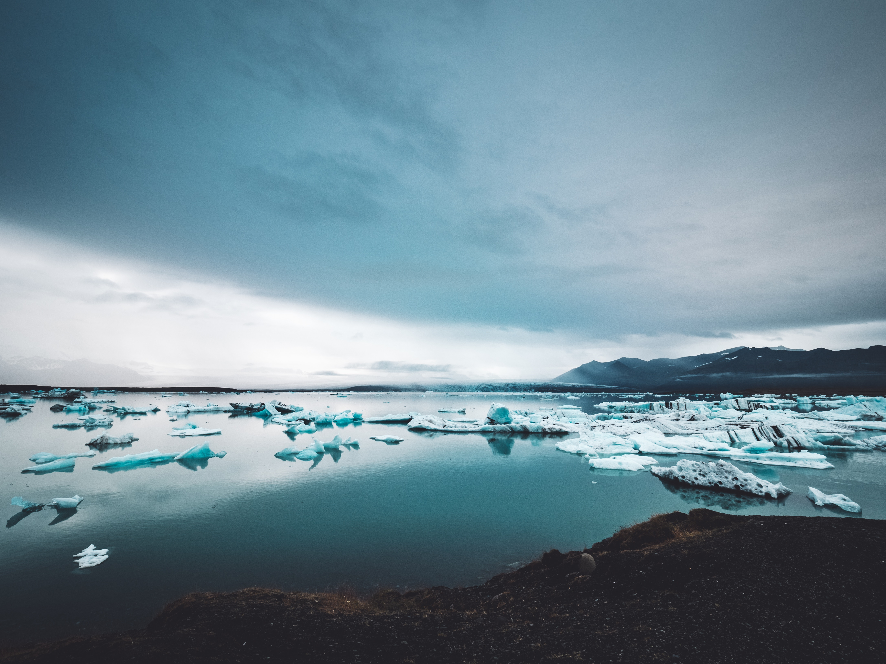
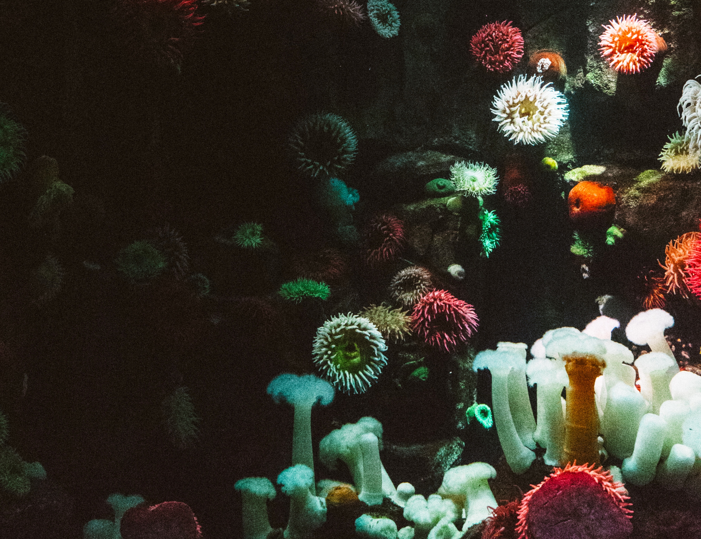
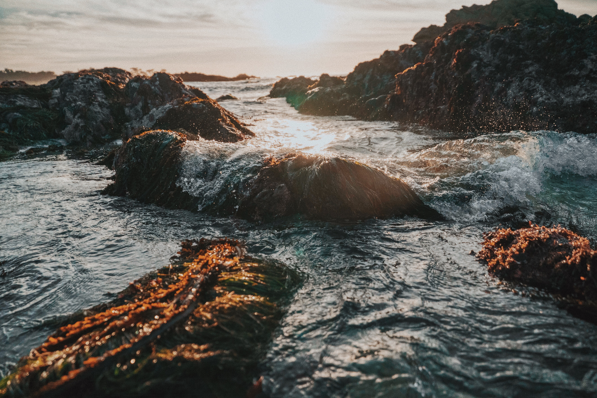
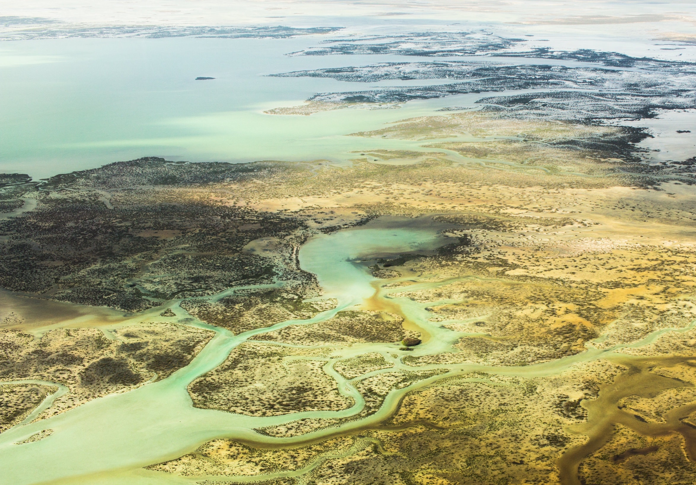

```{r setup, include=FALSE}
knitr::opts_chunk$set(echo = TRUE, fig.align = "center", fig.width = 20)
```

<br>

## What is the Ocean Health Index?
***


WORK ON PROGRESS... Short introduction to the OHI!


_Photo by John Salvino on Unsplash_


_Photo by Nick Karvounis on Unsplash_



_Photo by Scott Webb on Unsplash_



_Photo by Grant Porter on Unsplash_


_Photo by Romello Williams on Unsplash_