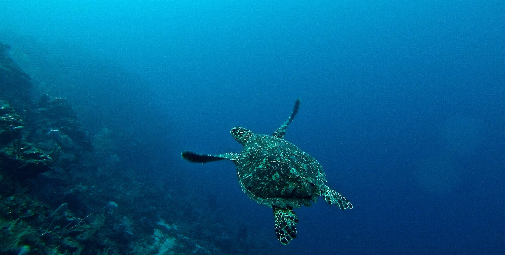

```{r setup, include=FALSE}
knitr::opts_chunk$set(echo = TRUE, fig.align = "center", fig.width = 20)
```

<br>

## What is the Ocean Health Index?
***


<br>

> In a world with over seven billion people, nearly half of whom live near the coast, we urgently need new analytical approaches to [balance] potentially conflicting public goals and connect human development with the ocean’s capacity to sustain progress (Halpern et al., Nature 2012).

<br>

[](http://ohi-science.org/ohi-global/goals.html)
_Photo by Erin Simmons on Unsplash_

<br>

We all benefit in some shape or form from a healthy ocean. Directly or indirectly, we all rely on the ocean’s services: food, livelihood, recreational opportunities, or regulation of the global climate. The enormity of the ocean, a sparsity of data about the detailed goings-on in its depths, and conflicting views on what constitutes responsible resource use make sustainable management of this wide range of benefits a big task.

<br>


_Photo by Nick Karvounis on Unsplash_

<br>

Maintaining a broad range of benefits requires a method that is both comprehensive and quantitative.  
_What gets measured, gets managed_ -- so the saying goes. 

The OHI was designed to measure how well we are managing those resources that we want and need from the ocean. Optimal management means using the resources sustainably, but also to their fullest capacities within the sustainable range, as it is the _coupled human–ocean system_ we are most interested in managing.

The index comprising ten diverse public goals, is a powerful tool to direct management, and also to raise public awareness, improve policy, and prioritize research ([Halpern et al., Nature 2012](https://www.nature.com/articles/nature11397)). Without further ado, the 10 goals of the OHI are:

<br>

<div style="float: left; width: 10.4%;"> 


</div> 

<div style="float: left; width: 89.6%;"> 
### 1. [Food Provision: Wildcaught Fisheries & Mariculture](http://ohi-science.org/goals/#food-provision)
<br>

### 2. [Artisanal Fishing Opportunities](http://ohi-science.org/goals/#artisanal-fishing-opportunities)
<br>

### 3. [Natural Products](http://ohi-science.org/goals/#natural-products)
<br>

### 4. [Carbon Storage](http://ohi-science.org/goals/#carbon-storage)
<br>

### 5. [Coastal Protection](http://ohi-science.org/goals/#coastal-protection)
<br>

### 6. [Sense of Place: Lasting Special Places & Iconic Species](http://ohi-science.org/goals/#sense-of-place)
<br>

### 7. [Livelihoods & Economies](http://ohi-science.org/goals/#livelihoods-and-economies)
<br>

### 8. [Tourism & Recreation](http://ohi-science.org/goals/#tourism-and-recreation)
<br>

### 9. [Clean Waters](http://ohi-science.org/goals/#clean-waters) 
<br>

### 10. [Biodiversity: Species & Habitat](http://ohi-science.org/goals/#biodiversity)
<br>
<br>

</div> 


<br>
<br>
<br>

***
***


_Photo by John Salvino on Unsplash_


***
